# Lab #6 — Infraestructura como Código con Terraform (Azure)
**Curso:** ARSW  


## Propósito
Modernizar el laboratorio de balanceo de carga en Azure usando **Terraform** para definir, aprovisionar y versionar la infraestructura. El objetivo es que los estudiantes diseñen y desplieguen una arquitectura reproducible, segura y con buenas prácticas de _IaC_.

## Objetivos de aprendizaje
1. Modelar infraestructura de Azure con Terraform (providers, state, módulos y variables).
2. Desplegar una arquitectura de **alta disponibilidad** con **Load Balancer** (L4) y 2+ VMs Linux.
3. Endurecer mínimamente la seguridad: **NSG**, **SSH por clave**, **tags**, _naming conventions_.
4. Integrar **backend remoto** para el _state_ en Azure Storage con _state locking_.
5. Automatizar _plan_/**apply** desde **GitHub Actions** con autenticación OIDC (sin secretos largos).
6. Validar operación (health probe, página de prueba), observar costos y destruir con seguridad.

> **Nota:** Este lab reemplaza la versión clásica basada en acciones manuales. Enfócate en _IaC_ y _pipelines_.

---

## Arquitectura objetivo
- **Resource Group** (p. ej. `rg-lab8-<alias>`)
- **Virtual Network** con 2 subredes:
  - `subnet-web`: VMs detrás de **Azure Load Balancer (público)**
  - `subnet-mgmt`: Bastion o salto (opcional)
- **Network Security Group**: solo permite **80/TCP** (HTTP) desde Internet al LB y **22/TCP** (SSH) solo desde tu IP pública.
- **Load Balancer** público:
  - Frontend IP pública
  - Backend pool con 2+ VMs
  - **Health probe** (TCP/80 o HTTP)
  - **Load balancing rule** (80 → 80)
- **2+ VMs Linux** (Ubuntu LTS) con cloud-init/Custom Script Extension para instalar **nginx** y servir una página con el **hostname**.
- **Azure Storage Account + Container** para Terraform **remote state** (con bloqueo).
- **Etiquetas (tags)**: `owner`, `course`, `env`, `expires`.

> **Opcional** (retos): usar **VM Scale Set**, o reemplazar LB por **Application Gateway** (L7).

---

## Requisitos previos
- Cuenta/Subscription en Azure (Azure for Students o equivalente).
- **Azure CLI** (`az`) y **Terraform >= 1.6** instalados en tu equipo.
- **SSH key** generada (ej. `ssh-keygen -t ed25519`).
- Cuenta en **GitHub** para ejecutar el pipeline de Actions.

---

## Estructura del repositorio (sugerida)
```
.
├─ infra/
│  ├─ main.tf
│  ├─ providers.tf
│  ├─ variables.tf
│  ├─ outputs.tf
│  ├─ backend.hcl.example
│  ├─ cloud-init.yaml
│  └─ env/
│     ├─ dev.tfvars
│     └─ prod.tfvars (opcional)
├─ modules/
│  ├─ vnet/
│  │  ├─ main.tf
│  │  ├─ variables.tf
│  │  └─ outputs.tf
│  ├─ compute/
│  │  ├─ main.tf
│  │  ├─ variables.tf
│  │  └─ outputs.tf
│  └─ lb/
│     ├─ main.tf
│     ├─ variables.tf
│     └─ outputs.tf
└─ .github/workflows/terraform.yml
```

---

## Bootstrap del backend remoto
Primero crea el **Resource Group**, **Storage Account** y **Container** para el _state_:

```bash
# Nombres únicos
SUFFIX=$RANDOM
LOCATION=eastus
RG=rg-tfstate-lab8
STO=sttfstate${SUFFIX}
CONTAINER=tfstate

az group create -n $RG -l $LOCATION
az storage account create -g $RG -n $STO -l $LOCATION --sku Standard_LRS --encryption-services blob
az storage container create --name $CONTAINER --account-name $STO
```
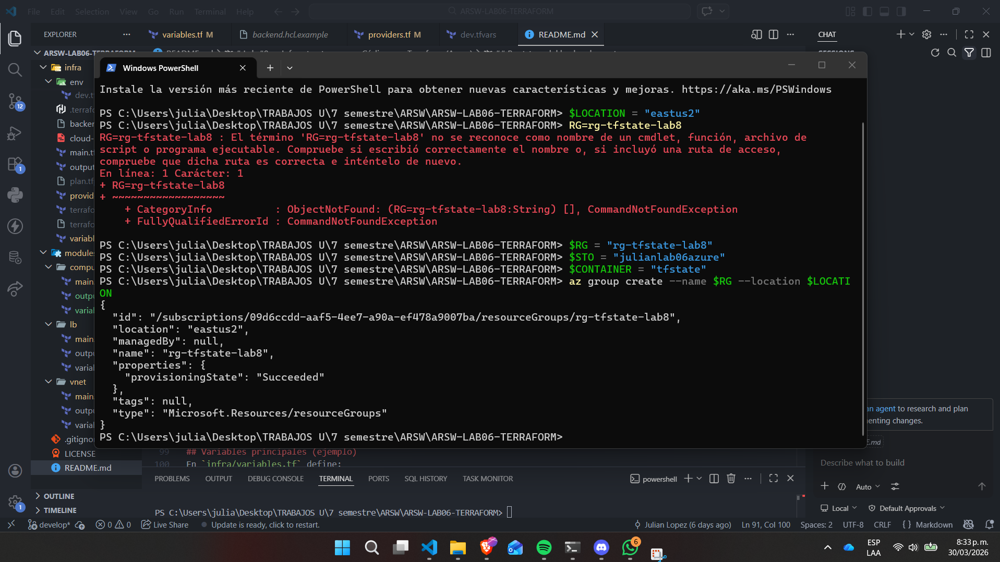
---
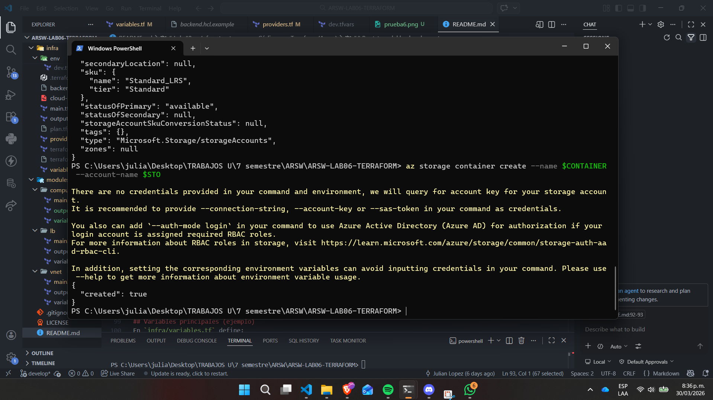
---
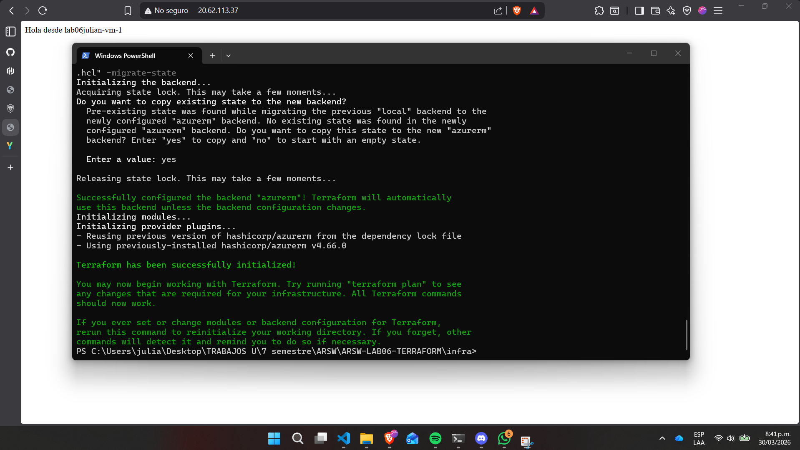

Completa `infra/backend.hcl.example` con los valores creados y renómbralo a `backend.hcl`.
Quedaria de la siguiente forma: 

```terraform
resource_group_name  = "rg-tfstate-lab8"
storage_account_name = "julianlab06azure"
container_name       = "tfstate"
key                  = "lab8/terraform.tfstate"
```


---

## Variables principales (ejemplo)
En `infra/variables.tf` define:
- `prefix`, `location`, `vm_count`, `admin_username`, `ssh_public_key`
- `allow_ssh_from_cidr` (tu IPv4 en /32)
- `tags` (map)

En `infra/env/dev.tfvars`:
```hcl
prefix        = "lab8"
location      = "eastus"
vm_count      = 2
admin_username= "student"
ssh_public_key= "~/.ssh/id_ed25519.pub"
allow_ssh_from_cidr = "X.X.X.X/32" # TU IP
tags = { owner = "tu-alias", course = "ARSW/BluePrints", env = "dev", expires = "2025-12-31" }
```

---

## cloud-init de las VMs
Archivo `infra/cloud-init.yaml` (instala nginx y muestra el hostname):
```yaml
#cloud-config
package_update: true
packages:
  - nginx
runcmd:
  - echo "Hola desde $(hostname)" > /var/www/html/index.nginx-debian.html
  - systemctl enable nginx
  - systemctl restart nginx
```

---

## Flujo de trabajo local
```bash
cd infra

# Autenticación en Azure
az login
az account show # verifica la suscripción activa

# Inicializa Terraform con backend remoto
terraform init -backend-config="backend.hcl" -migrate-state
# Revisión rápida
terraform fmt -recursive
terraform validate

# Plan con variables de dev
terraform plan -var-file=env/dev.tfvars -out plan.tfplan

# Apply
terraform apply "plan.tfplan"

# Verifica el LB público (cambia por tu IP)
curl http://$(terraform output -raw lb_public_ip)
```

**Outputs esperados** (ejemplo):
- `lb_public_ip`
- `resource_group_name`
- `vm_names`

Para el flujo de trabajo tenemos que al inicializar terraform y validar se puede observar de la siguiente forma:

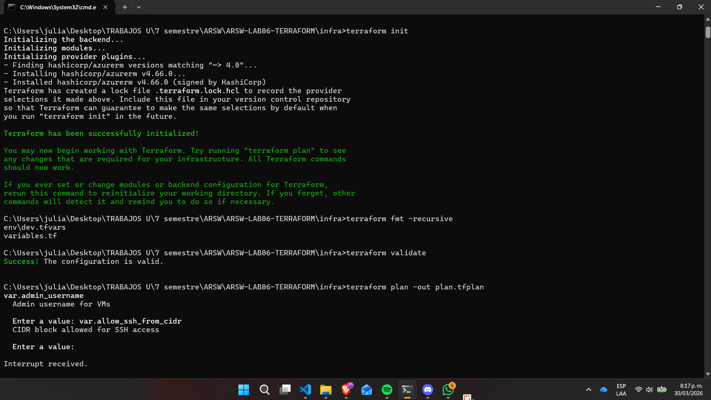
---

Luego para el plan de ejecución de terraform:

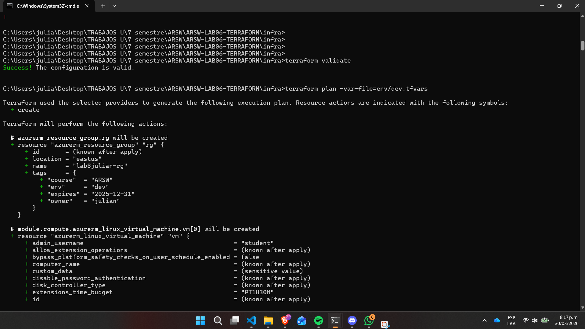
---

Las pruebas se pueden observar en las siguientes imagenes: 

Desde el navegador hacemos la solicitud y se ve de la siguiente forma:

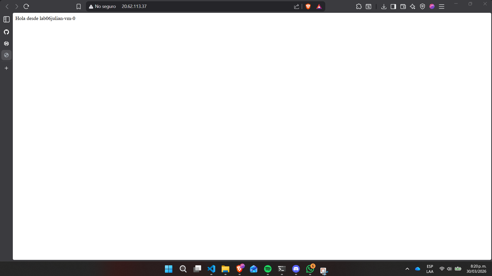
---
Luego de unos momentos el balanceador de carga hace su trabajo y se ve de la siguiente forma:

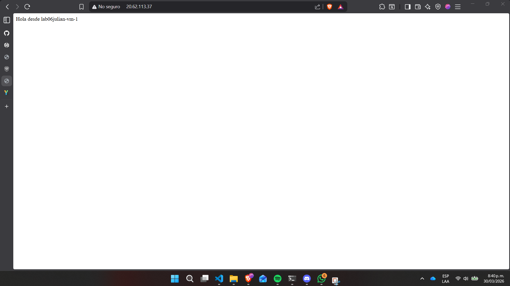
---

Haciendo las pruebas con curl desde la consola: 

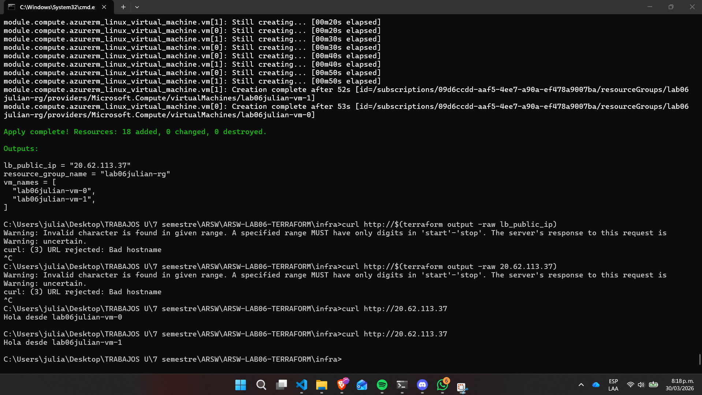

Finalmente en Azure se puede visualizar

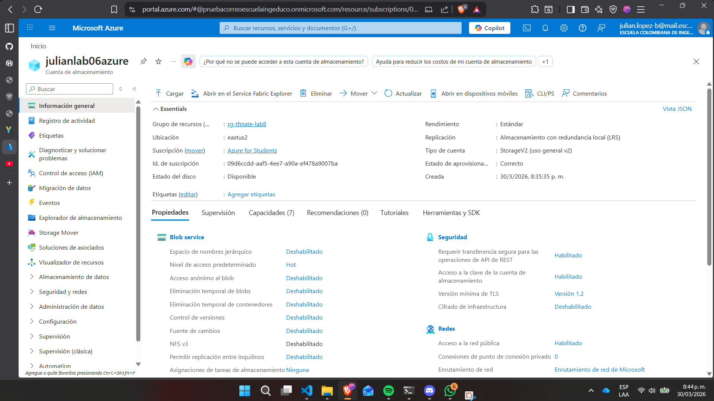
---

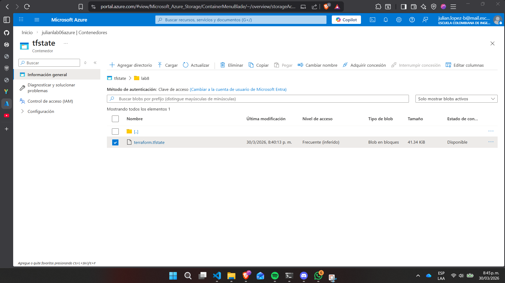


Prueba de destrucción: 

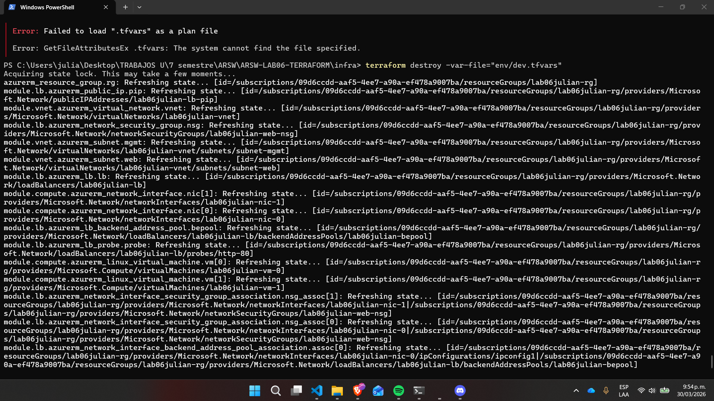
---
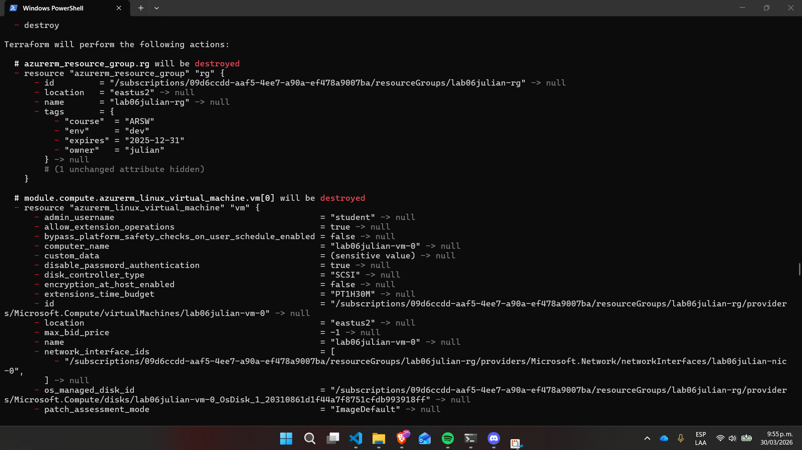
---
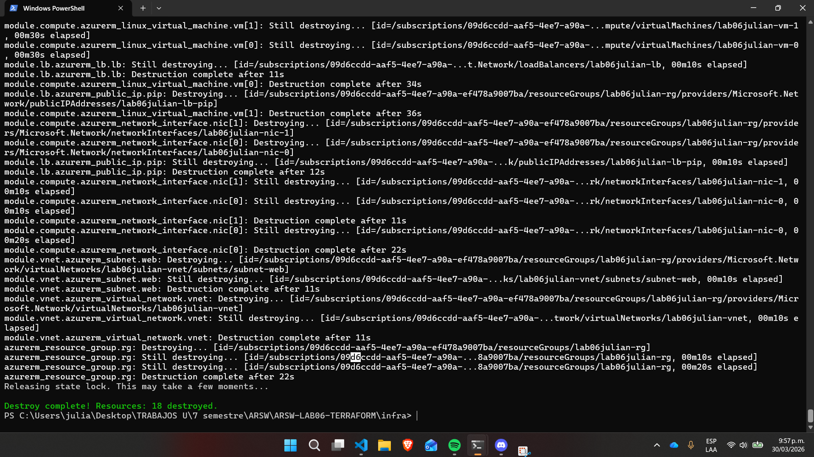

## GitHub Actions (CI/CD con OIDC)
El _workflow_ `.github/workflows/terraform.yml`:
- Ejecuta `fmt`, `validate` y `plan` en cada PR.
- Publica el plan como artefacto/comentario.
- Job manual `apply` con _workflow_dispatch_ y aprobación.

**Configura OIDC** en Azure (federación con tu repositorio) y asigna el rol **Contributor** al _principal_ del _workflow_ sobre el RG del lab.

En esta sección no se pudo realizar la configuracion del OIDC por falta de permisos en la cuenta de Azure Estudiantes que la universidad nos brinda: 

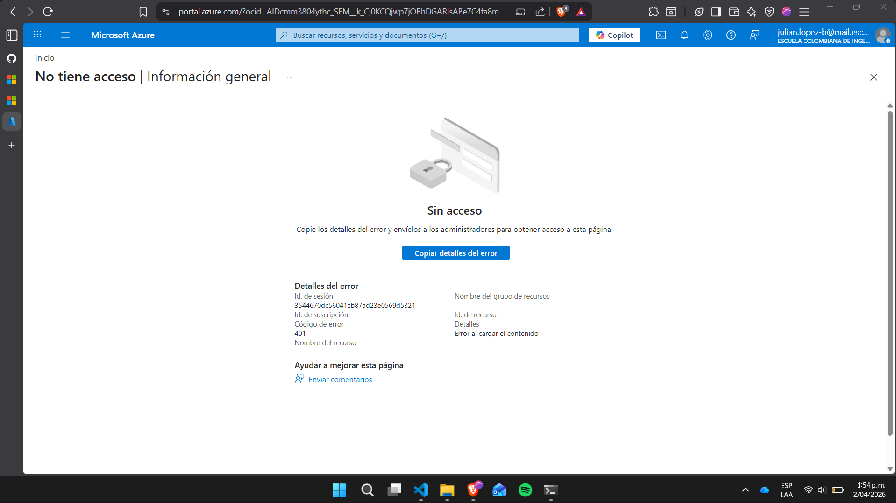

---


## Limpieza
```bash
terraform destroy -var-file=env/dev.tfvars
```

> **Tip:** Mantén los recursos etiquetados con `expires` y **elimina** todo al terminar.

---

## Preguntas de reflexión
- ¿Por qué L4 LB vs Application Gateway (L7) en tu caso? ¿Qué cambiaría?
  En este laboratorio se usó Azure Load Balancer (L4) porque el objetivo principal era distribuir tráfico HTTP simple entre maquinas virtuaes con la menor complejidad y costo y L4B brinda lo básico para los balanceadores de carga que se querian ver en este laboratorio. Se cambiaria a L7 en dado caso de querer algo mas avanzado como redirecciones HTTP a un puerto mas seguro como lo es HTTPS por ejemplo y asi brindar en cierta parte algo mas de seguridad

- ¿Qué implicaciones de seguridad tiene exponer 22/TCP? ¿Cómo mitigarlas?

  Publicar SSH hacia Internet aumenta un rango vulnerable que se va a tener en cuestiones de seguridad, como ataques y demas. En el laboratorio se permitio exponer 22/TCP solo desde una IP específica que es la dirección IP privada y usando autenticación por llave SSH (sin contraseña). 
- ¿Qué mejoras harías si esto fuera **producción**? (resiliencia, autoscaling, observabilidad).

- ¿Qué mejoras harías si esto fuera producción? (resiliencia, autoscaling, observabilidad).

  Fortalecer la red y seguridad con subredes privadas, un cofre de llaves o palabras importantes, políticas de Azure y TLS extremo a extremo, tambien se podria implementar observabilidad con Azure Monitor y algunas alertas, métricas para los balanceadores y dashboards.

---

## Reflexión Tecnica

El uso de Terraform permitió gestionar la infraestructura como código, facilitando la reproducibilidad, versionamiento y automatización del despliegue. Una de las decisiones clave fue separar la configuración por ambientes (por ejemplo, dev mediante archivos .tfvars), lo que mejora la organización y evita errores al manejar múltiples entornos.

### Decisiones tomadas

Se optó por utilizar un backend remoto en Microsoft Azure, específicamente mediante Storage Accounts, para almacenar el estado (terraform.tfstate). También se decidió usar el flujo plan → apply con archivos de salida (.tfplan) para garantizar que los cambios revisados sean exactamente los que se aplican mediante el powershell.

Otra decisión importante fue seguir la modularización que se tenia en el repositorio inicia lo cual en dado caso de querer implementar los retos por ejemplo facilita la reutilización y mantenimiento del código.

### Trade-offs

El principal trade-off es entre simplicidad y escalabilidad. Mantener todo en un solo archivo .tf es más simple, pero menos mantenible; en cambio, dividir en módulos mejora la organización.

También existe un trade-off entre rapidez y control. Ejecutar directamente terraform apply es más rápido, pero usar terraform plan agrega una capa de seguridad que reduce errores, especialmente en entornos productivos. Otro aspecto es el manejo del estado remoto: aunque mejora la colaboración, introduce dependencia de costos adicionales como en este caso en la nube de Azure que al elegir el plan "mas barato" se puede sacrificar y depender de esto .

### Costos
### Estimación Mensual (~$38 USD)
- VMs: 2x Standard_B1s × ~$7.59/mes = $15.18
- Load Balancer: Basic tier = $18/mes
- Public IP: ~$3/mes
- Storage Account: ~$0.50/mes
- VNet/NSG: $0 (included)

### Procedimiento de Destrucción Segura

1. Verificar estado actual: `terraform state list`
2. Revisar plan de destrucción: `terraform plan -var-file="env/dev.tfvars"`
3. Ejecutar destrucción: `terraform destroy -var-file="env/dev.tfvars"`
4. Confirmar en Azure Portal que recursos fueron eliminados
5. Eliminar backend Storage Account 

El uso de Terraform garantiza que todos los recursos definidos sean eliminados de forma consistente y secuencial para asi quede correctamente.

## Créditos y material de referencia
- Azure, Terraform, IaC, LB y VMSS (docs oficiales) — revisa enlaces en clase.
